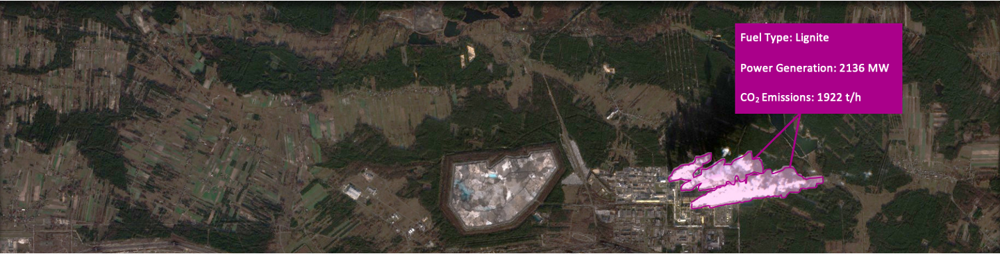

# Remote Sensing CO2 Estimation

Code base for the paper **Multitask Learning for Estimating Power Plant Greenhouse Gas Emissions from Satellite Imagery**, presented at *Tackling Climate Change with Machine Learning* workshop at NeurIPS 2021 and our follow-up paper **Physics-Guided Multitask Learning for Estimating Power Generation and CO2 Emissions From Satellite Imagery** published at IEEE Transactions of Geoscience and Remote Sensing, 2023 [[paper link](https://ieeexplore.ieee.org/stamp/stamp.jsp?arnumber=10153694)].

## About this Project

The burning of fossil fuels produces large amounts of carbon dioxide (CO2), a major Greenhouse Gas (GHG) and a main driver of Climate Change.
Quantifying GHG emissions is crucial for accurate predictions of climate effects and to enforce emission trading schemes. The reporting of such emissions is only required in some countries, resulting in insufficient global coverage.
In this work, we propose an end-to-end method to predict power generation rates for fossil fuel power plants from satellite images based on which we estimate GHG emission rates. We present a multitask deep learning approach able to simultaneously predict: (i) the pixel-area covered by plumes from a single satellite image of a power plant, (ii) the type of fired fuel, and (iii) the power generation rate. We then convert the predicted power generation rate into estimates for the rate at which CO2 is being emitted.
Experimental results show that our model approach allows us to estimate the power generation rate of a power plant to within 139 MW (MAE, for a mean sample power plant capacity of 1177 MW) from a single satellite image and CO2 emission rates to within 311 t/h.
This multitask learning approach improves the power generation estimation MAE by 39% compared to a single-task network trained on the same dataset.

The dataset is available on [zenodo.org](https://doi.org/10.5281/zenodo.5874537)
